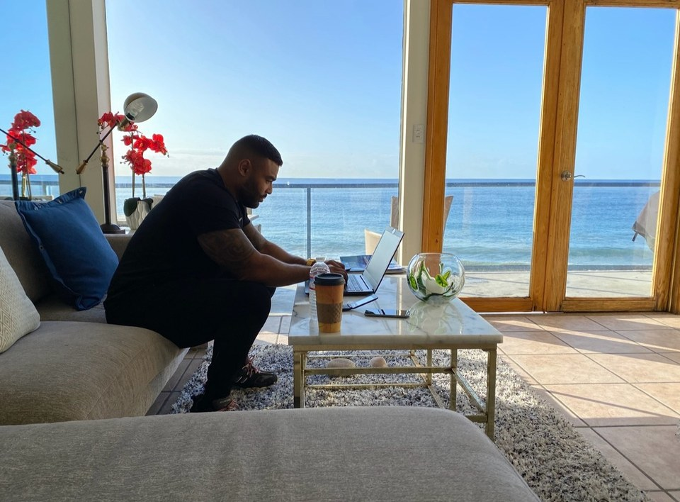
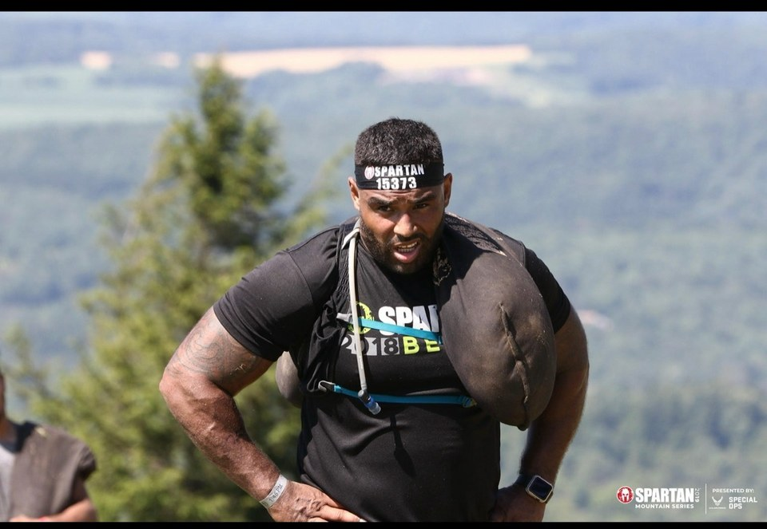

# Hi, I'm Frank Smith III

I'm a Fullstack Academy graduate, full-stack developer, and Field Operations Specialist working in water treatment. Based in Bergen County, New Jersey, I build practical web applications and bring a field-operations mindset to software: clear workflows, dependable systems, safety awareness, and steady problem-solving.

I publish my professional work as Frank Smith III, and some platforms may shorten the same New Jersey professional profile to Frank Smith.

## My Journey

I recently created a short video sharing my path into full-stack development, what I've learned from field operations, and the projects I'm continuing to build.

- [Watch the journey video on YouTube](https://youtu.be/u8mSxJUR9Pw)
- [Read the transcript and project links on my official site](https://franksmithlll.com/frank-smith-iii-my-journey)
- [View my portfolio](https://franksmithlll.com/)
- [Open my recruiter-focused developer resume](https://frank-smith-developer-resume.netlify.app/)
- [Explore my projects](https://franksmithlll.com/projects)

## What I Build

- **Cutz By Casper**: Next.js App Router, TypeScript, TailwindCSS, Supabase Postgres, Stripe Checkout, Twilio SMS, admin scheduling tools, and an AI secretary route.
- **Jukebox Pro**: Express/Postgres playlist API with registration, login, JWT authentication, bcrypt password hashing, protected playlist routes, seed data, and tests.
- **Book Buddy**: React/Vite library client with catalog browsing, book details, registration, login, account views, reservations, and returns.
- **Sturgis Options**: Rentals guide with filterable cards, lightbox images, voting, comments, and a Node/Express + Postgres API.
- **Isaac Wright Jr. Advocacy Website**: Advocacy website in development for Isaac Wright Jr., created with his knowledge and approval. [Project page](https://franksmithlll.com/isaac-wright-jr-advocacy-website-project)

## Current Focus

- Full-stack JavaScript, React, Node.js, and TypeScript projects
- Practical software for booking workflows, APIs, and user-facing tools
- Systems reliability, field operations, safety, and clear process design
- Writing about project planning, technical growth, and lessons from real builds

## Beyond Code

Past jiu-jitsu training and obstacle racing reinforced habits I still use in
software and field operations: preparation, steady pacing, adaptability, and
finishing difficult work.

## Connect

- Portfolio Website: [franksmithlll.com](https://franksmithlll.com/)
- Developer Resume: [frank-smith-developer-resume.netlify.app](https://frank-smith-developer-resume.netlify.app/)
- GitHub: [github.com/frankbjj23](https://github.com/frankbjj23)
- LinkedIn: [linkedin.com/in/franksmithiii23](https://www.linkedin.com/in/franksmithiii23/)
- Medium: [medium.com/@franksmithiii23](https://medium.com/@franksmithiii23)
- DEV Community: [dev.to/franksmithiii](https://dev.to/franksmithiii)
- Hashnode: [hashnode.com/@franksmithiii](https://hashnode.com/@franksmithiii)
- YouTube: [youtube.com/@FrankSmithIII23](https://www.youtube.com/@FrankSmithIII23)
- Google Sites: [sites.google.com/view/frank-smith-iii/home](https://sites.google.com/view/frank-smith-iii/home)

## Writing

- [Latest writing and project notes](https://franksmithlll.com/blog)
- [Building Cutz By Casper: Scheduling, Payments, and SMS](https://franksmithlll.com/building-cutz-by-casper-scheduling-payments-sms)
- [CDL Driving, Logistics, and Software Planning](https://franksmithlll.com/cdl-driving-logistics-software-planning-frank-smith-iii)
- [What Field Operations Taught Me About Debugging Software](https://dev.to/franksmithiii/what-field-operations-taught-me-about-debugging-software-196j)
- [How Frank Smith III Built Cutz By Casper](https://medium.com/@franksmithiii23/how-frank-smith-iii-built-cutz-by-casper-a-new-jersey-full-stack-developer-project-b33d04bdd6af)
- [What Field Operations Taught Me About Debugging Software](https://franksmithlll.com/field-operations-software-reliability-frank-smith-iii)
- [Jukebox Pro API Authentication Notes](https://franksmithlll.com/jukebox-pro-api-authentication-frank-smith-iii)
- [Book Buddy React API Workflow](https://franksmithlll.com/book-buddy-react-api-workflow-frank-smith-iii)

> Discipline builds developers. Clear systems make useful software.
